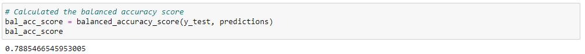

# DABC-Credit_Risk_Analysis

## Overview

The purpose of this analysis is to utilize a number of Machine Learning models to assess credit card risks by predicting the classification of each credit card holder in a given dataset into two classes: High Risk and Low Risk. The end goal is to determine which model is the best Machine Learning model in determining credit card risk. The below 6 models were used: 

1. Naive Random Oversampling
2. SMOTE Oversampling
3. Undersampling
4. SMOTEENN (Combination of oversampling and undersampling)
5. Balanced Random Forest
6. Easy Ensemble AdaBoost

## Results

Below two summary tables summarizes the Balanced Accuracny Score and the Precision, Recall, and F1 score for each model. Detailed screenshots are presented in the Results Support section.

Balanced Accuracy Score Summary

</img>

Imbalanced Classification Report Summary

</img>

### Results Support

- Naive Random Oversampling - Balanced Accuracy Score
</img>

- Naive Random Oversampling - Imbalanced Classification Report
</img>

- SMOTE Oversampling - Balanced Accuracy Score
</img>

- SMOTE Oversampling - Imbalanced Classification Report
</img>

- Undersampling - Balanced Accuracy Score
</img>

- Undersampling - Imbalanced Classification Report
</img>

- SMOTEENN (Combination) - Balanced Accuracy Score
</img>

- SMOTEENN (Combination) - Imbalanced Classification Report
</img>

- Balanced Random Forest - Balanced Accuracy Score
</img>

- Balanced Random Forest - Imbalanced Classification Report
</img>

- Balanced Random Forest - Top Features
</img>

- Easy Ensemble AdaBoost - Balanced Accuracy Score
</img>

- Easy Ensemble AdaBoost - Imbalanced Classification Report
</img>

## Summary
In summary, Ensemble Algorithms tend to perform the best. Both Easy Ensemble AdaBoost and Balanced Random Forest performed the best with respect to Balance Accuracy Scores and F1 scores on predicting High Risk and Low Risk cardholders. Easy Ensemble AdaBoost model would be the preferred model out of all 6 Machine Learning models used in this analysis. This is due to its high accuracy at 93%, its superiority in its F1 score on classifying high risk cardholders, and it's exceptionally high recall score on classifying high risk cardholders, outperforming all other models at 92%. This is the most important assessment metric for the purpose of this analysis. Having a 92% recall score on classifying high risk cardholders implies that out of all cardholders that were indeed high risk, 92% of them were accuracly predicted by the model.